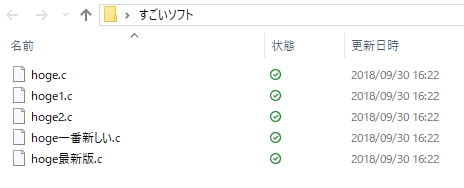
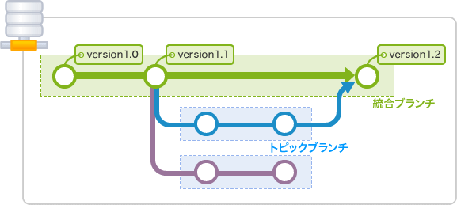

### なるべく簡単にgit解説

@mii123450

---

### 到達目標
作ったものをgitで管理できるようにする

---
 
### 1. gitとは
 
+++
 
### バージョン管理システム
バージョン管理システムの最も基本的な機能は、ファイルの作成日時、変更日時、変更点などの履歴を保管することである。これにより、何度も変更を加えたファイルであっても、過去の状態や変更内容を確認したり、変更前の状態を復元することが容易になる。更に、多くのバージョン管理システムでは、複数の人間がファイルの編集に関わる状況を想定している。商業的なソフトウェア開発やオープンソースプロジェクトなどでは、複数の人間が複数のファイルを各々編集するため、それぞれのファイルの最新の状態が分からなくなったり、同一ファイルに対する変更が競合するなどの問題が生じやすいが、バージョン管理システムは、このような問題を解決する仕組みを提供する。ただし、バージョン管理システムを個人のファイル管理に使用することも可能であるし、ソフトウェアのソースコードだけでなく、設定ファイルや原稿の管理などにも使うことも可能である。(wikipediaより引用)

+++

### つまり

+++

### バージョンを管理するシステム

+++

+++

バージョン管理システムはほかにもある
<ul>
 <li>SVN</li>
 <li>Mercurial</li>
 <li>etc...</li>
</ul>

+++

### 他のは知らん

+++

### 管理方式

- 集中型 |
- 分散型 |

+++

### gitは分散型

---

### 2.githubとの関係

+++

### 一言で
- クラウドでソースコードを管理できるようになる |

+++

### 使うメリット
- USBなどを使わずに出先でプロジェクトを引っ張れる |
- 他の人と一つのプロジェクトを動かしやすくなる　|

---

### 3.使ってみよう

+++

~~~
git init
git add <filename>
git commit -m "<comment>"
git checkout <id> <filename>
git checkout -b <branchname>
~~~
@[1](カレントディレクトリにgitリポジトリを作成する)
@[2](ステージにファイルをあげる)
@[3](ステージに上がった変更点を確定させる)
@[4](指定したコミットファイルを展開する)
@[5](作業ブランチを変更する)

+++

### 知らん用語多すぎ

+++

### ステージ

 picture by git-scm.com

+++

### ブランチ

 picture by backlog.com/ja/git-tutorial/stepup/stepup1_2.html
